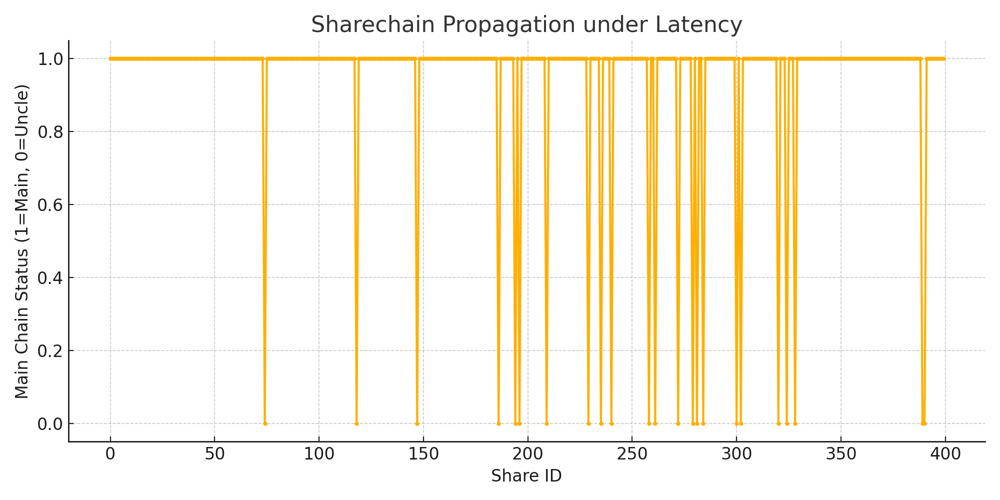

# Sharechain Latency Simulation

This project simulates a peer-to-peer blockchain sharechain where share propagation between nodes experiences random network latency.  
It studies how network delays impact the percentage of shares becoming uncles or orphans in a DAG-based structure.

---

## Motivation

In decentralized mining pools like P2Pool v2, timely share propagation is critical.  
Delays in communication can lead to forks, increasing the number of uncle or orphan shares.

Before applying to Summer of Bitcoin 2025, I developed this project to explore the relationship between network latency and blockchain share propagation.

This simulation helped me gain experience in:

- C++ network simulation and concurrency
- Modeling latency effects on DAG growth
- Measuring orphan and uncle rates
- Visualizing peer-to-peer share distribution

---

## Simulation Details

- Nodes produce shares at random intervals
- Network latency is modeled with random delays
- Shares are propagated to peers
- DAG growth is tracked and uncle/orphan status is recorded

---

## Simulation Result

Below is a graph showing the share propagation status over time:

The simulation shows that under moderate latency, a majority of shares are incorporated into the main chain, while some become uncles due to delayed propagation.

---

